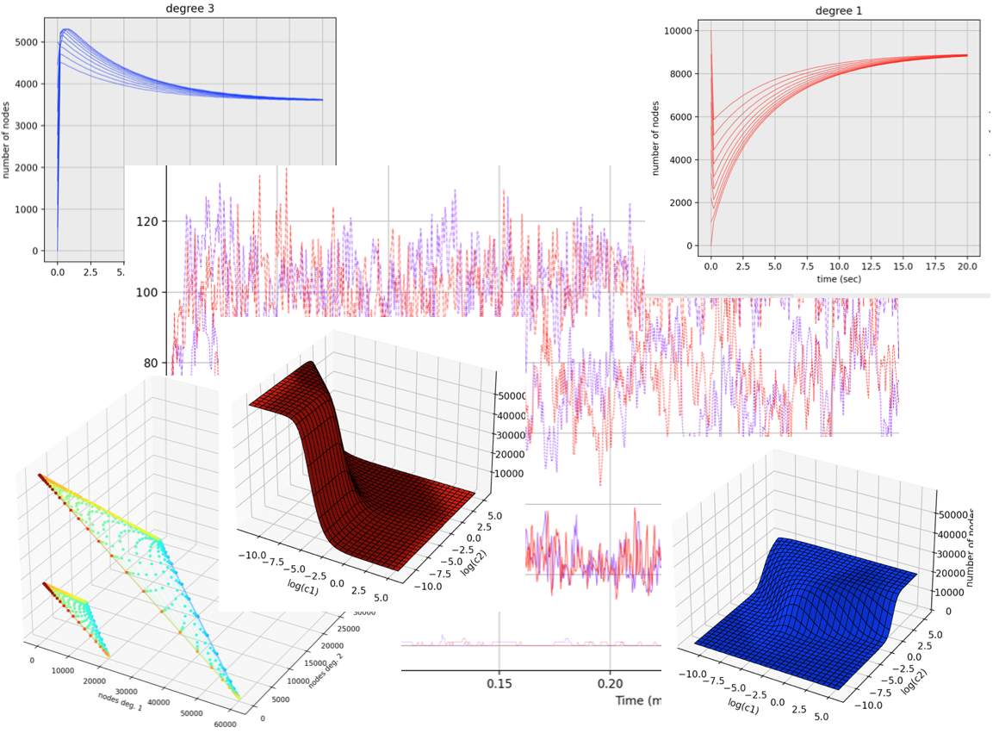

# mitoSim-postProcessor


Complements [**mitoSim**](https://github.com/vsukhor/mitoSim) - the simulator of cell mitochondria 
as a spacelss graph.

This repository contains Python 3 code for:

* Numerical solution and analysis of differential-algebraic system approximating 
  the mitochondria graph [src/odes.py](src/odes.py)

* Analysis of some simulation results reported in the 
  logfile [src/time_dependent.py](src/time_dependent.py).  
While the actual logfile is to be generated by running the **mitoSim** simulation, example
  files are given in [/data](/data) directory.

For convenience, the scripts are accompanied by the corresponding ipython notebooks.

The recommended way of working with the **mitoSim-postProcessor** is by using Python 
virtual environment:

```bash
$ python3 -m venv venv  
$ source ./venv/bin/activate  
(venv) $ pip install -r requirements.txt   
```
Then, the script can be launched the ordinary way:

```bash
(venv) $ python src/odes.py   
```
To install and use the notebook:

```bash
(venv) $ pip install jupyter  
(venv) $ jupyter notebook odes.ipynb   
```
The scripts were tested with Python 3.9 and jupyter-notebook v. 6.0.3.

**mitoSim-postProcessor** is available under the terms of the [MIT license](LICENSE.md).


